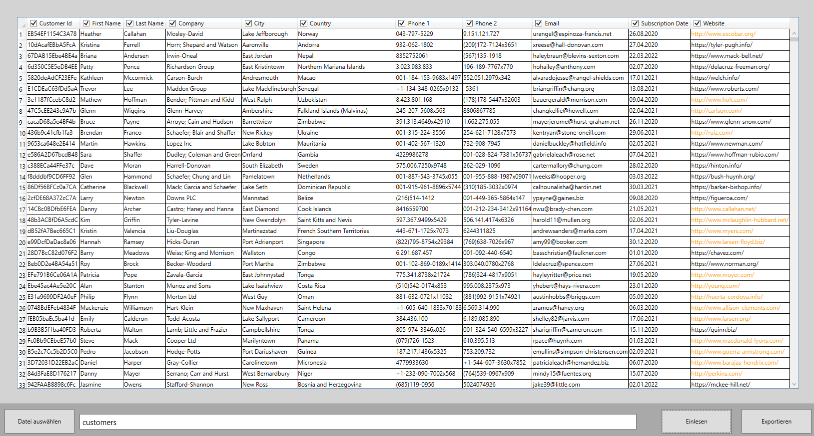

# CSV Reader Tool

A Windows desktop application built with C#, WPF and the MVVM pattern for importing CSV files, reviewing their contents and exporting selected columns to Microsoft Excel.

The project focuses on asynchronous file processing, responsive user interaction and a clean separation between the user interface and application logic.



---

## Features

- 📂 Import CSV files
- 📊 Display imported data in a WPF DataGrid
- ☑️ Select individual columns for export
- 📑 Export selected data to Excel (.xlsx)
- ⚡ Asynchronous file import and export
- ⏹️ Cancel long-running operations
- 🎨 Automatic highlighting of HTTP/HTTPS links
- 🔢 Automatic row numbering
- ❗ Error handling for invalid files
- 🪟 Automatically opens the exported file location after a successful export

---

## Built With

- C#
- .NET Framework
- WPF
- MVVM
- XAML
- EPPlus
- TextFieldParser
- Data Binding
- Async / Await
- CancellationToken
- Git

---

## Project Structure

```text
CSVReaderTool
│
├── Ansichten      # Views
├── Befehle        # Commands
├── Converter      # Value converters
├── Logik          # Business logic
├── Modelle        # Models
└── Properties
```

---

## How it works

1. Select a CSV file.
2. Import the data.
3. Review the imported information.
4. Choose which columns should be exported.
5. Save the result as an Excel file.

---

## What I learned

While developing this project I gained practical experience with:

- WPF desktop application development
- MVVM architecture
- Data Binding
- ICommand implementations
- Asynchronous programming with `async` / `await`
- Cancellation using `CancellationToken`
- Reading structured CSV files
- Exporting Excel files using EPPlus
- Creating reusable value converters
- Organizing projects into a maintainable structure

---

## Planned Improvements

- Support different CSV delimiters
- Progress indicator during import and export
- Drag & Drop support
- Improved UI styling
- Unit tests
- Sample CSV files

---

## Getting Started

### Requirements

- Windows
- Visual Studio
- .NET Framework

### Installation

Clone the repository:

```bash
git clone https://github.com/barcikowskialek/CSVReaderTool.git
```

Open the solution in Visual Studio, restore the NuGet packages and start the application.

---

## License

This project is published for educational and portfolio purposes.
